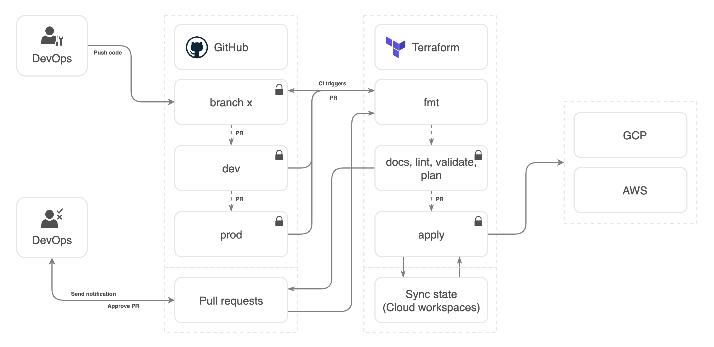
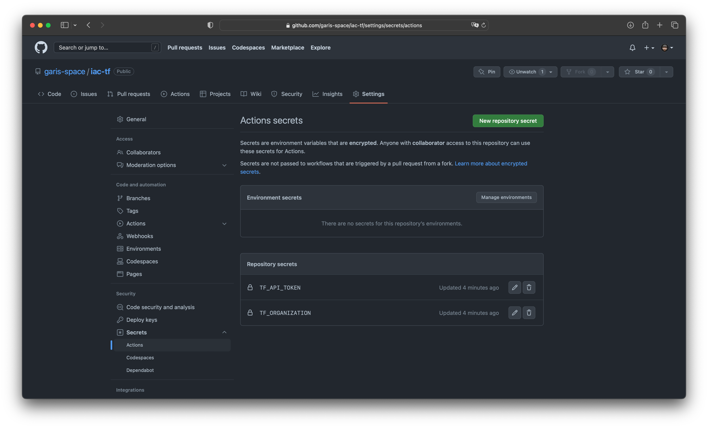
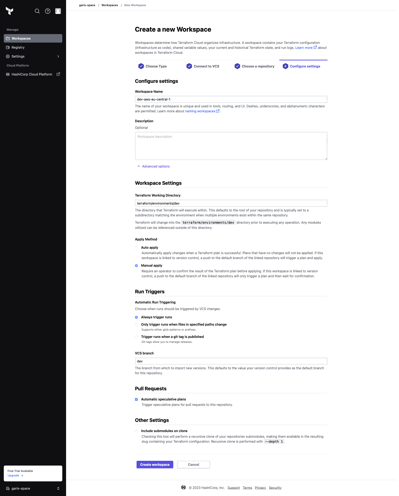
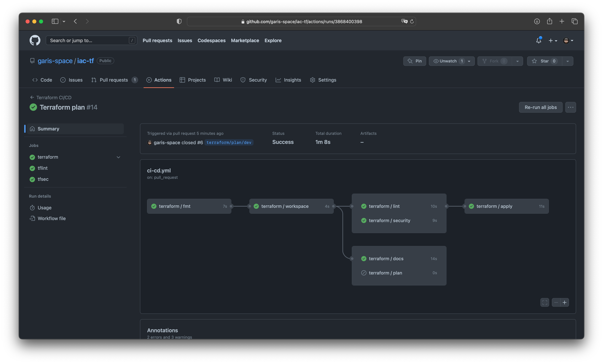
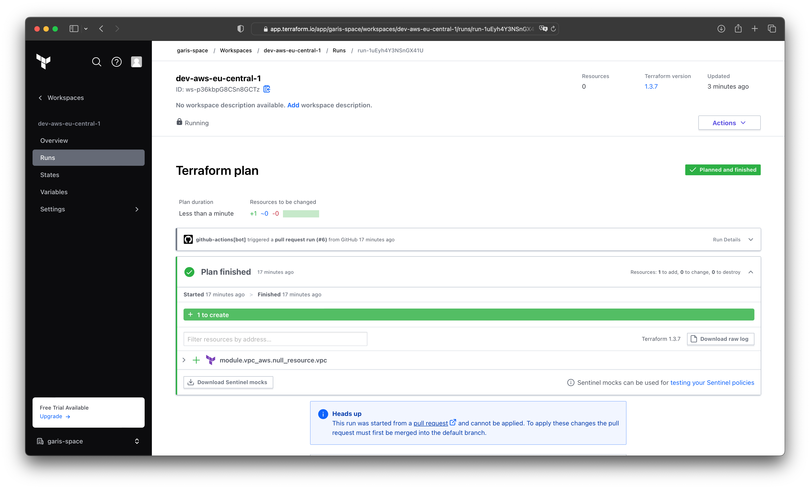

# Reusable Terraform Workflow for GitHub Actions with Multiple Environments

This Workflow will check if the Terraform code is formatted, valid, secure, generate documentation, create a workspace in Terraform Cloud, plan the Terraform code and apply the Terraform code if the pull request is merged. Terraform directory structure has been designed to be reusable across multiple cloud providers and multiple environments.



#
### Prerequisites

This post assumes that you will create or have an account with Terraform Cloud.
- [Terraform Cloud Account](https://app.terraform.io)

#
### Step 1 - Terraform Cloud (free tier)
```bash
# Create a Terraform Cloud account
https://app.terraform.io

# Create a Terraform Cloud organization
https://app.terraform.io/app/organizations/new

# Create a Terraform Cloud Organization API token
https://app.terraform.io/app/<ORGANIZATION_NAME>/settings/authentication-tokens

# Save the Terraform Cloud Organization API token, you will need it later in the GitHub repository secrets
```

#
### Step 2 - Project

You can fork the repository `https://github.com/garis-space/iac-tf` or use your own repository with the same directory structure.

If you are using your own repository, you need to copy only the `.github/workflows/ci-cd.yml` file to your repository and change the line
from
    `uses: './.github/workflows/terraform.yml'`
to
    `uses: 'garis-space/iac-tf/.github/workflows/terraform.yml'`

Then set the Terraform Cloud Organization API Token and Organization Name as the secret in the GitHub repository settings as shown in the screenshot below.



Clone forked or your own repository to your local machine.

```bash
git clone git@github.com:garis-space/iac-tf.git
cd iac-tf
```

In the root directory of the project we have terraform directory structure that is designed to be reusable across multiple cloud providers and multiple environments. The directory structure is as follows:
- modules (Terraform modules)
  - vpc
    - aws (Terraform module for the AWS VPC)
    - gcp (Terraform module for the GCP VPC)
- environments (Terraform workspaces)
  - dev (Terraform workspace for the dev environment)
  - prod (Terraform workspace for the prod environment)

#
### Step 3 - Create a Terraform Cloud workspaces
```bash
# Create a git branch for the `dev` environment and push it to the remote repository
git checkout -b dev
git push origin dev

# Create a git branch for the `prod` environment and push it to the remote repository
git checkout -b prod
git push origin prod
```

Login to the Terraform Cloud and navigate to Create a new Workspace https://app.terraform.io/app/garis-space/workspaces/new.

Choose the Version Control Workflow and select the GitHub repository that you forked in the previous step.

Workspace name should be the same as defined in the `environments/<ENVIRONMENT_NAME>/backend.tf` file. For example, if you are creating a workspace for the `dev` environment, the workspace name should be `dev-aws-eu-central-1` or you can change the workspace name in the `environments/<ENVIRONMENT_NAME>/backend.tf` file to match the workspace name in Terraform Cloud.

In Advanced Options you must type the name of Terraform Working Directory. For example, if you are creating a workspace for the `dev` environment, the Terraform Working Directory should be `terraform/environments/dev`.

The last option that you need to set is the VCS branch. For example, if you are creating a workspace for the `dev` environment, the VCS branch should be `dev`.

The same steps must be followed for each new environment.



#
### Step 4 - Run Workflow
```bash
# Create a git branch for the `feature/dev` from dev branch
git checkout -b feature/dev dev

# Change some code in the *.tf files, for example, change the name of the VPC from `Main` to `Primary` in the `terraform/modules/vpc/aws/main.tf`, commit the changes and push it to the remote repository
git add .
git commit -m "Change VPC name"
git push origin feature/dev
```

You can create a pull request from the `feature/dev` branch to the `dev` branch and merge it.

The workflow will run and create a pull request with the terraform plan and another pull request with the documentation. You can review the changes and merge the pull request with the terraform plan. The workflow will run again and check linting, formatting, validation, security, documentation and apply the changes to the `dev` environment.



And you can check the status of the GitHub action workflow in the Terraform Cloud.


